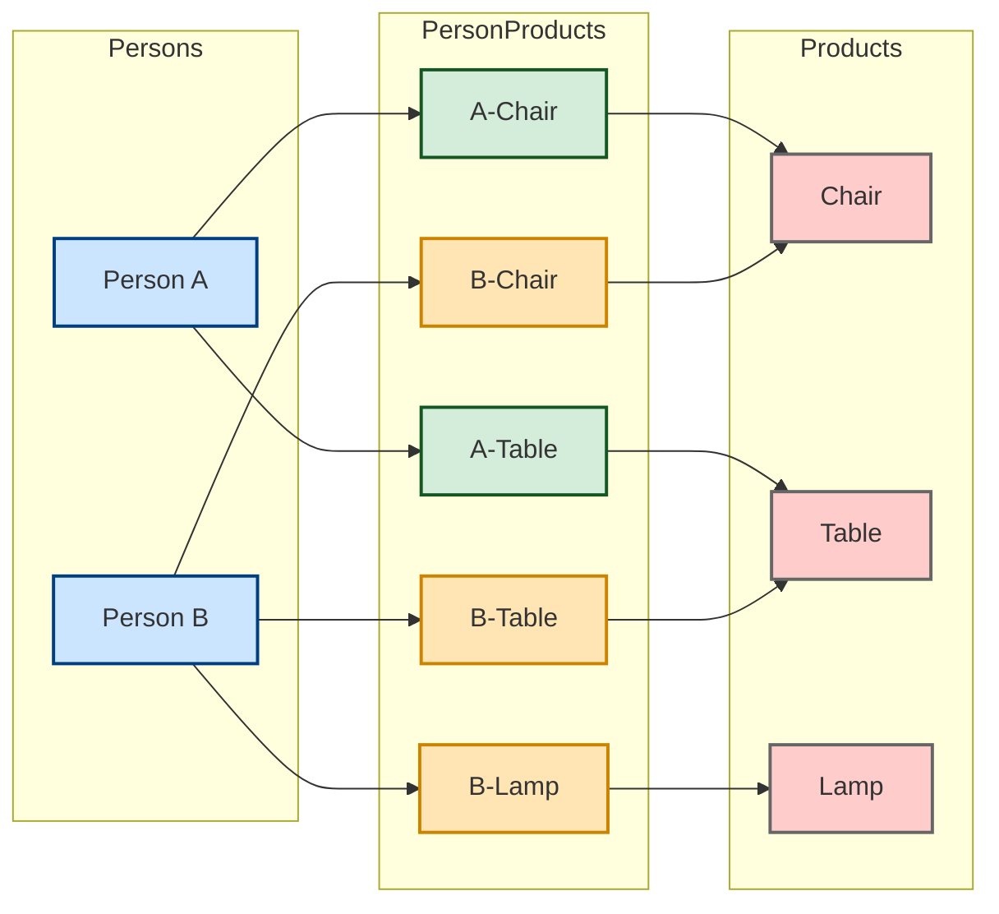
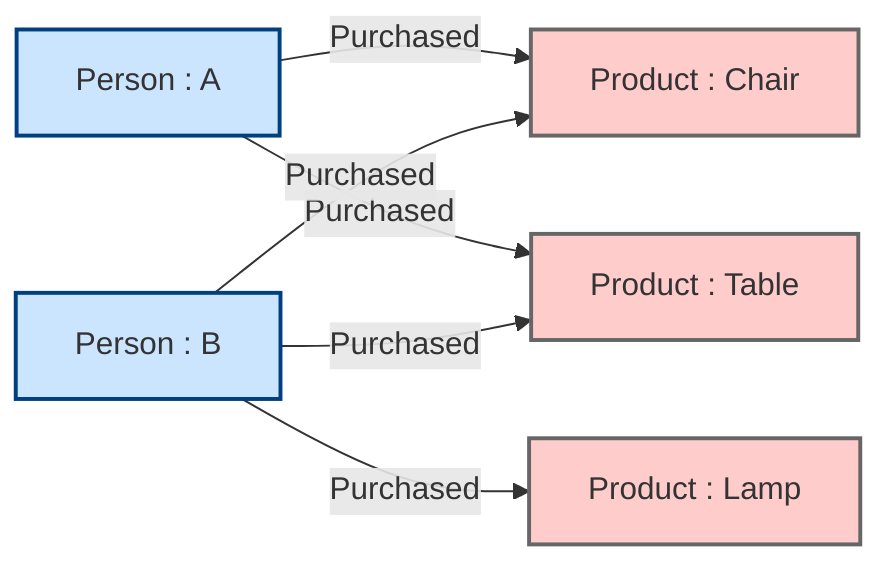

# Agentic Knowledge Graph

---

To transform structured and unstructured data into the knowledge graph, you first need to decide the graph schema, what types of entities or nodes you can extract from the data and what relationships exists between them.

## What is a Knowledge Graph?



We could construct a recomender system from this. We know what `A` purchases. We know who else purchases the product that `A` purchases. We also know the additional products that they purchases. Based on this, we can recommend new products to `A`.



```
Knoweledge graph is a kind of database that represents information as nodes representing things like people, products, blogs and relationships that add information about pairs of things like purchased, authored, liked.
```

Query Language : `Cipher`, for quering from the graph.

Example : root-cause analysis

A furniture manufaturer trying understand the complaints.

- Which products have the most issues?
- What part of the product is the problem?
- Is there a problem with the part itself?
